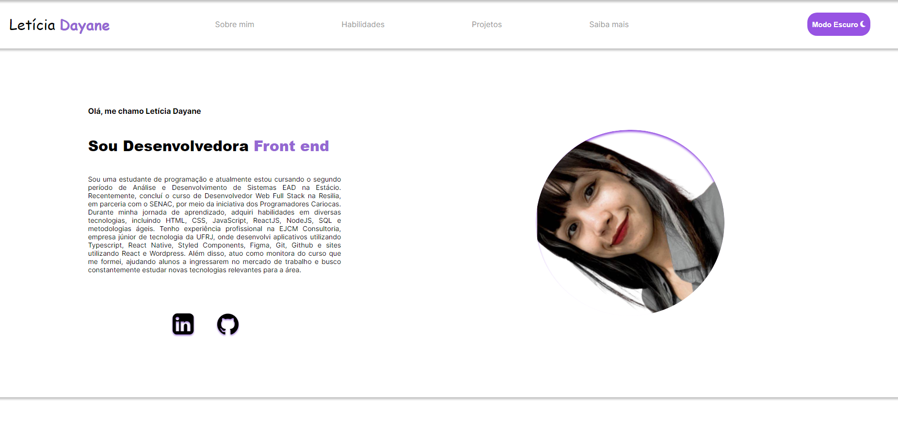

# Portfolio - Letícia Dayane
Este é o repositório do meu projeto pessoal de portfolio desenvolvido com React, Next.js, TypeScript e Styled Components. Aqui você encontrará informações sobre mim, minhas habilidades, projetos principais e alguns detalhes sobre meus interesses pessoais.
<br><br>
Acesse pelo link: https://kaleidoscopic-basbousa-fcf2bc.netlify.app
<br>



## Visão Geral
Este projeto foi criado com o objetivo de apresentar minha trajetória profissional, destacar minhas habilidades técnicas e exibir alguns dos projetos nos quais trabalhei. Além disso, o tema do site pode ser alternado entre claro e escuro para atender às preferências de visualização do usuário.

## Tecnologias Utilizadas
React<br>
Next.js<br>
TypeScript<br>
Styled Components<br>
Instruções de Execução

## Para executar o projeto localmente, siga as etapas abaixo:

Clone o repositório para o seu ambiente local.

Navegue até o diretório do projeto.

Instale as dependências usando o gerenciador de pacotes de sua preferência (npm ou yarn).

```bash
npm install
```

Inicie o servidor de desenvolvimento.

```bash
npm run dev
```

Abra o navegador e acesse http://localhost:3000 para visualizar o portfolio.

## Menu
O menu de navegação contém os seguintes itens:

<p>Sobre Mim: Uma breve descrição sobre minha história profissional e paixão pelo desenvolvimento web.
Habilidades: Lista das habilidades técnicas que possuo, com um indicador visual de meu nível de domínio em cada uma.
</p><p>Projetos: Exibição dos projetos principais nos quais trabalhei, com detalhes sobre cada projeto e links para acessá-los.
</p><p>Saiba Mais: Nesta seção, compartilho alguns detalhes sobre meus interesses pessoais e conteúdos que curto.
</p><p>Tema Claro e Escuro
</p><p>O portfolio oferece a opção de escolher entre os temas claro e escuro. O botão de alternância pode ser encontrado no canto superior direito do site. Ao clicar nele, o tema será alterado para o modo correspondente.
</p>

## Letra "Front End" e "Full Stack"
A página inicial do site possui um efeito interessante em que a frase "Front End" e "Full Stack" são alternadas periodicamente, representando minhas habilidades nessas áreas.


## Licença
Este projeto está licenciado sob a MIT License - veja o arquivo LICENSE.md para mais detalhes.